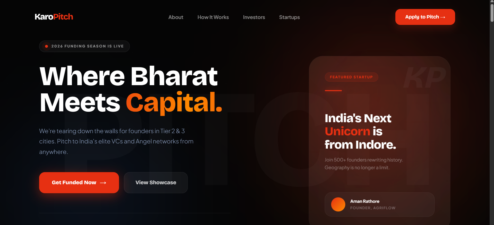

# 🚀 Karo Pitch – Demo Landing Page

A modern demo landing page designed for **Karo Pitch**, an initiative by **KaroStartup** that enables early-stage founders across India to pitch their startups directly to investors.

This project was created as part of the **KaroStartup Intern Assignment** to demonstrate product thinking, UI design, and the ability to build a startup-focused landing page.

---

## 🌐 Live Demo

🔗 https://karo-startup-assignment.vercel.app

---

## 📌 Project Overview

Karo Pitch aims to bridge the gap between **startup founders and investors** by creating a platform where entrepreneurs can present their businesses and raise funding.

Many founders from **Tier-2 and Tier-3 cities in India** are building amazing businesses but lack access to investor networks and mentorship.

This landing page demonstrates how Karo Pitch could present its platform to founders and investors through a clean and structured website.

---

## 🎯 Features

- ⚡ Modern startup-style landing page
- 📢 Clear hero section with call-to-action
- 🧠 About Karo Pitch section
- 🔄 Simple 4-step pitching process
- 🏢 Categories of startups that can apply
- 💰 Investor showcase section
- 🚀 Featured startups section
- 📱 Mobile-friendly responsive design

---

## 🧩 Website Sections

The homepage includes the following sections:

1️⃣ **Hero Section**  
Introduces the platform and encourages founders to apply.

2️⃣ **About Karo Pitch**  
Explains the purpose and mission of the platform.

3️⃣ **How It Works**  
A simple 4-step process explaining how founders can pitch their startups.

4️⃣ **Who Can Apply**  
Highlights categories such as:
- D2C brands  
- Consumer startups  
- MSMEs  
- SaaS startups  
- Manufacturing businesses  
- Bharat-focused startups  

5️⃣ **Investors Section**  
Shows investors looking for promising startups.

6️⃣ **Featured Startups**  
Example startup cards demonstrating how startups may appear on the platform.

7️⃣ **Final Call To Action**  
Encourages founders to apply or partner with the platform.

---

## 🛠 Tech Stack

- **React.js**
- **Vite**
- **Tailwind CSS**
- **JavaScript**
- **HTML5**
- **CSS3**

Deployment:

- **Vercel**

---

## 📸 Preview

---

## 📂 Project Purpose

This project was built to demonstrate:

- UI/UX design thinking
- Startup product landing page design
- Ability to structure information clearly
- Use of modern frontend tools

---

## 👨‍💻 Author

**Gaurav Kumar**

GitHub  
https://github.com/AlphaGaurav13

## 🌐 Live Demo

🔗 https://karo-startup-assignment.vercel.app
---

## ⭐ Acknowledgement

This project was created as part of the **KaroStartup Intern Assignment** for designing a demo landing page for **Karo Pitch**.

---
